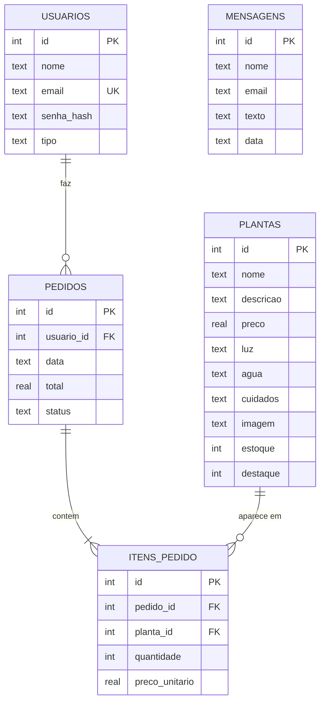
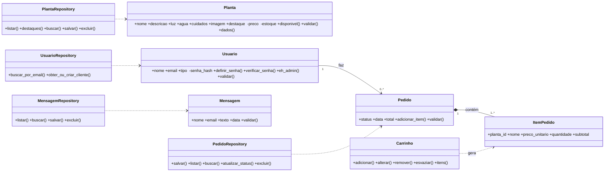

# Diagramas

## Modelo entidade-relacionamento (BD)

```mermaid
erDiagram
  USUARIOS ||--o{ PEDIDOS : faz
  PEDIDOS ||--|{ ITENS_PEDIDO : contem
  PLANTAS ||--o{ ITENS_PEDIDO : "aparece em"
  USUARIOS { int id PK
    text nome
    text email UK
    text senha_hash
    text tipo }
  PLANTAS { int id PK
    text nome
    text descricao
    real preco
    text luz
    text agua
    text cuidados
    text imagem
    int estoque
    int destaque }
  PEDIDOS { int id PK
    int usuario_id FK
    text data
    real total
    text status }
  ITENS_PEDIDO { int id PK
    int pedido_id FK
    int planta_id FK
    int quantidade
    real preco_unitario }
  MENSAGENS { int id PK
    text nome
    text email
    text texto
    text data }
```

## Diagrama de classes (POO)

```mermaid
classDiagram
  direction LR
  class Planta { +nome +descricao +luz +agua +cuidados +imagem +destaque  -preco  -estoque +disponivel() +validar() +dados() }
  class Usuario { +nome +email +tipo  -senha_hash +definir_senha() +verificar_senha() +eh_admin() +validar() }
  class Pedido { +status +data +total +adicionar_item() +validar() }
  class ItemPedido { +planta_id +nome +preco_unitario +quantidade +subtotal }
  class Mensagem { +nome +email +texto +data +validar() }
  class Carrinho { +adicionar() +alterar() +remover() +esvaziar() +itens() }
  class PlantaRepository { +listar() +destaques() +buscar() +salvar() +excluir() }
  class UsuarioRepository { +buscar_por_email() +obter_ou_criar_cliente() }
  class PedidoRepository { +salvar() +listar() +buscar() +atualizar_status() +excluir() }
  class MensagemRepository { +listar() +buscar() +salvar() +excluir() }
  Usuario "1" --> "0..*" Pedido : faz
  Pedido "1" *-- "1..*" ItemPedido : contém
  Carrinho ..> ItemPedido : gera
  PlantaRepository ..> Planta
  UsuarioRepository ..> Usuario
  PedidoRepository ..> Pedido
  MensagemRepository ..> Mensagem
```
